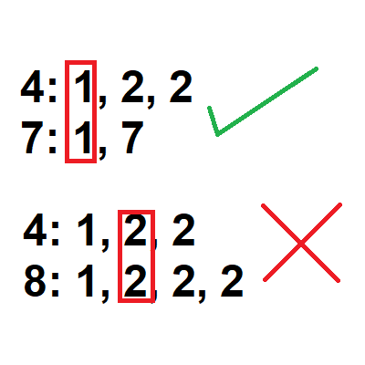

# How to solve Coprimes in array


You seems to have hit the wall, but don't worry, you will be facing how to solve this problem along this document.

## Decompose

First of all you must remember the golden rule "**Don't solve one big problem, solve many tiny problems**".

**Definition of the problem**: Given a set of N positive integer numbers, determine when this are coprimes or not.

As a statement, whe know what is coprime, a coprime are two numbers which is Highest Common Factor (HCF) is 1.

*It seems like an easy problem, we only need to check if a set HCF is 1, but maybe you are wondering, How I implement this?*

You have been given the details to implement with two numbers, but the problem states **given a set of N positive integer numbers**, so how can you validate this? First of all, don't care about the specific details, first of all you need to implement **validate if pair of numbers are coprimes**.

*You can try solving this by yourself or keep reading*.

### A pair of numbers are coprimes

For this task, also we need to remember the golden rule, decompose the problem.

**Problem**: Validate if a pair of numbers are coprimes.

**Definitions**:

* **Coprime**: Two numbers are coprime if is Highest Common Factor (HCF) is 1.
* **Factor**: Is a number that divides another number evenly i.e. with no remainder.

**Pieces of the problem**:

1. Get the Factors of each number. (Factors A, Factors B)
2. Check if there is a number in Factors B that is repeated in Factors A.



*Step 2 it's an easy task, the problem you are facing now is to **get the factors of a given number***

*Again. You can try solving this by yourself or keep reading*.

### Getting the factors of a number

We have reached a point where we can't decompose the problem, in other words, we are now in the roots of the problem. Once we solve this problem, everything is going to be like the smooth.

We already know this:

**Factor**: Is a number that divides another number evenly i.e. with no remainder.

So, our given problem is to get the factor of a number. But how are we gonna get all the factors of a number? Well, the answer is really easy, remember the definition of **Factor**.

In many programming languages, for not saying all of them, we have an operator called *modulo*, the expression is the following:

```c
int remainder = 5 % 3; // 2
```

***Tip**: Modulo is going to return the remainder of a division*

Maybe you're asking why this instruction is important. It's because we are going to need this instruction to get the factors of a number. There are many ways to solve this problem, the brute force way or the efficent way. Both of them, use the following rule with the modulo operator:

```c
// If the number has no remainder when is divided by iterator
if (number % iterator == 0) {
    // Iterator is a factor of the number
} else {
    // Iterator is not a factor of the number
}
```

But the previous fragment of code, will only validate one number, we need to get all the factors of a number. For example:

*Given 8 as the number, we want to get his factors: 1 x 2 x 2 x 2*

The algorithm to get the factors is the following:

1. We start with $iterator=2$, $number=8$ and $lower$ being the lowest number to validate, on this case as we are only comparing 8, it will be $lower = 8$.
2. While $lower >= iterator^2$
    1. If $(number/iterator)$ has remainder of $0$
        1. Save the $iterator$ as a **factor**.
        2. $number = number / iterator$.
        3. Repeat step 2.1
    2. If $remainder > 0$
        1. $iterator = iterator + 1$.
        2. Repeat step 2.
3. Save the $iterator$ as a **factor**.

***Notes***:
1. Why $lower >= iterator^2$?, it's because it will reduce the quantity of numbers that are not factor of the number.

Once you have coded the algorithm, you can solve how to determine the coprimes.

## Wrapping up

You have reached the end of this guide, with the previous information you have:

1. How to get the factors of a number
2. How to determine if 2 numbers are coprime

Now, you can deal with the current problem:
*Determine if a set of numbers are coprime.*

As a partner in this track, I will mentor you to consider the following to solve this problem.

1. You have received all the info that you need to make an efficient solution.
2. You don't need to store all the factors in memory. _Remember: You must determine if they are coprime or not_.
3. The algorithm that was defined to get the factors of a number can be modified to check if a set of numbers have a common factor, how? think in a loop. However there is additional considerations:
    1. 8 can be divided by 2, 3 times; but 6 can only be divided 1 time. You must only increment $iterator$ when all the numbers in set have $remainder > 0$
    2. Also, if you find a factor for all the numbers you can stop.

Good Luck!!!