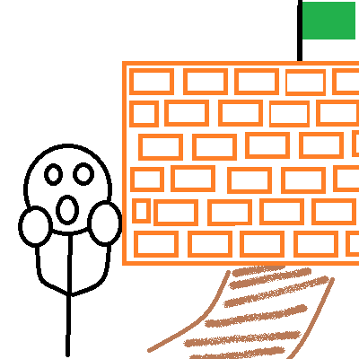

# How to solve Coprimes in array

You seems to have hit the wall, but don't worry, this document only exists to help you break the wall.

## Decompose

First of all you must remember the golden rule "**Don't solve one big problem, solve many tiny problems**".

**Definition of the problem**: Given a set of N positive integer numbers, determine when this are coprimes or not.

As a statement, whe know what is coprime, a coprime are two numbers which is Highest Common Factor (HCF) is 1.

*It seems like an easy problem, we only need to check if a set HCF is 1, but maybe you are wondering, How I implement this?*

You have been given the details to implement with two numbers, but the problem states **given a set of N positive integer numbers**, so how can you validate this? First of all, don't care about the specific details, first of all you need to implement **validate if pair of numbers are coprimes**.

*You can try solving this by yourself or keep reading*.

### A pair of numbers are coprimes

For this task, also we need to remember the golden rule, decompose the problem.

**Problem**: Validate if a pair of numbers are coprimes.

**Definitions**:

* **Coprime**: Two numbers are coprime if is Highest Common Factor (HCF) is 1.
* **Factor**: Is a number that divides another number evenly i.e. with no remainder.

**Pieces of the problem**:

1. Get the Factors of each number. (Factors A, Factors B)
2. Check if there is a number in Factors B that is repeated in Factors A.

*Step 2 it's an easy task, the problem you are facing now is to **get the factors of a given number***

*Again. You can try solving this by yourself or keep reading*.