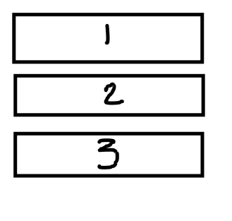

# How to Solve - Structured Stacks

## Mission 5 - Create a Stack using ADT

Make a program that uses the structures and functions of Stacks ADT to manage a set of points in the bidimensional plane.

The points entity must have the following structure:

```json
{
    "ID": "P01",
    "x": 1.333,
    "y": 1.333,
    "isValid": true,
}
```

While the Stack entity must have the following structure:
```json
{
    "size": 10,
    "points": [],
    "top": -1
}
```

If the Stack is **Full** or **Empty**, it must print the following messages:

* Stack is Full
* Stack is Empty

## Review - Stacks

What are stacks, how they work?

An Stack is a pile of objects, for example think that you have a pile of books.



If you want to read the book that is at the bottom you must dispatch the ones that are in the top.
If you want to read the last book in the pile, you only need to dispatch the last book.


Also if you want to insert a book in the pile, you need to put it at the top


## Objectives

So you have surrender and want to read the hints to solve this coding challenge. Don't be discouraged, remember that no one was able to solve his first coding challenges successfully.

Let's start.

Margot wants to open a Stack Library, where she sells first the newest books, and let the old ones to be selled at the final.

(Yeah, kinda strange Stack Library, but don't worry, personally you will be doing some garbage work, because the client requested it).

For this Stack Library we will be using the following structures, let's keep it simple to be able to **get to the point**.

```json
{// Book
    "code": 1,
}
```

```json
{// StackLibrary
    "books": [],
    "size": 10
}
```

### Objective 1. Learning Data Structures.

First we need to convert the previous structure to code, so it will be like:

```c++
typedef struct {
    int code;
    bool isValid;
} Book;

typedef struct {
    int size;
    Book *books;
    int top;
} StackLibrary;
```
**STOP**, you have noticed? we added in each object extra features.

The "isValid" feature in the Book, it's because the Stack pop function, must return a value, even if the Stack is empty, this "isValid" flag will tell us, if the book retrieved is one that was added or was created to fill the StackLibrary.

The "top" feature in the StackLibrary, will tell us what position has the latest book in the Stack, and will be used also to determine if a stack is full or empty.

### Objective 2. Initializing our Stack

The first thing our code need is to initialize our structure, so our main function will be like:

```c++
#define MAX 10;

int main()
{
    StackLibrary lib;
}
```

And that's all folks!

### Objective 3. Let's initialize the Stack Library

What is a Stack Library if it is not clean? but how we clean a Stack Library structure? Well, if you assist to your classes and take notes you will notice that is very simple...

```c++
void ClearStackLibrary(StackLibrary *s, int size)
{
    s->top  = -1;  // Throw all your books to garbage
    s->books = new Book[size];
    s->size = size; // How many books can be stored?
}
```

### Objective 4. Passing data by reference.

You must be trying to test if until now you are capable of getting all working, but you must be seeing that the following line is not helping:

```c++
int main() {
    // ...
    ClearStackLibrary(lib);
    // ...
}
```

I will tell you why, the function ClearStackLibrary expects a StackLibrary s to be passed by reference, but in the previous code we are passing a copy of the stack library, so it doesn't match what the functions expects.

A quite easy solution will be:
```c++
int main() {
    // ...
    ClearStackLibrary(&lib);
    // ...
}
```

With that & we are telling to pass the stack library as reference, so any changes made to the stack library will be global. 

Be aware of this, passing by reference and changing any value will be kept forever, even if you don't return anything. If you pass by value and make a change on that value, it will not kept the change, unless you return and update the parameter.

### Objective 5. I want to store HARRY POTTER AND THE GOBLET OF FIRE!

#### Step 1. We need to get the book.

We will need to create a Book element to store the data of Harry Potter.

And that is quite easy task, you will need to create a function that stores all your parameters into a book and return the book.

```c++
Book createBook(int code, bool isValid)
{
    Book elem;
    elem.code = code;
    elem.isValid = isValid;
    return elem;
}
```

#### Step 2. My Stack Library is Full?

Before we store the book we need to check if our Stack Library can store another book.

```c++
bool isFull(StackLibrary s) {
    return s.top >= (s.size - 1);
}
```

For that you need to check if you are not at the limit of storage.

#### Step 3. Store my Book!

Finally, after a long journey we can store Harry Potter! but how?

```c++
bool push(StackLibrary *s, Book elem)
{
    if (isFull(*(s))) {
        return false;
    }
    
    s->books[++s->top] = elem;
    return true;
}
```

Wait! why *(s) was sended to the isFull function?, well that because isFull expects a StackLibrary to be passed by value, but our push function has a StackLibrary being passed by reference, so we will need a way to convert that reference into a copy, and that is pointing the reference.

And what does the ++s->top operator mean?, well operator for adding or subtracting have two ways.

```c++
int main() {
    int i = 0;
    int j = i++; // Will return the value and then add 1
    // j will be 0, i will be 1

    i = 0;
    ++i; // Will add 1 and then return the value
    // i will be 1
}
```

### Objective 6. Can we return the newest book?

#### Step 1. My StackLibrary is empty!!!

The first thing you want to do before returning the last book, is to know if you have books. [Do it!](https://www.youtube.com/watch?v=ZXsQAXx_ao0)

```c++
bool isEmpty(StackLibrary s)
{
    return true; // You can do it! Do it!
    // For further info of what validation you must do, remember
    // You have a top, that indicates the position of the last book
    // ClearStackLibrary has the value for an empty StackLibrary.
}
```

#### Step 2. We have a problem... Houston

The pop functions as said before must return an empty book, there are many ways for this.

1. In the initialization of the books parameter in the StackLibrary, we could create 10 books with code = 0 and isValid = false. So that we can always return the first one.
2. (Our approach) is to create an empty book and return that.

You can try the first one if you like, but this guide will not provide more information to getting all working on that approach.

```c++
Book pop(StackLibrary *s) {
    if (isEmpty(*(s))) {
        return createBook(0, false);
    }

    return s->books[s->top--];
}
```

**Remember** we have explained what does mean the instructions i++ and ++i, the same logic is applied for the i-- and --i

### Objective 7. We need Control!

As you may noticed, you are testing individual functions, we need to control what we want to do (add, remove, initialize, exit). So we need to add a little control to our main function, this time will be on my count the control logic, complement with all your work!

```c++
#include <stdio.h>

// ... functions, headers, etc.

int main() {
    // ... initialization
    int order;

    do {
        // Get Order from the user
        scanf("%d", &order);

        switch (order) {
            case 1: // clear StackLibrary
                break;
            case 2: // push
                // retrieve info from user input
                // insert
                // was correctly inserted?
                break;
            case 3: // pop
                // retrieve last book
                // display the book
                break;
            default: // print "Unknown Order"
                break;
        }
    } while (order != 4);

    return 0;
}
```

Congratulations! now you can impress your crush with your new knowledge! [Please don't](https://external-content.duckduckgo.com/iu/?u=https%3A%2F%2Fi.pinimg.com%2F736x%2Fdd%2F8c%2F5a%2Fdd8c5a99031f8bd27cba078f91ee2827--wtf-face-no-meme.jpg&f=1&nofb=1)
