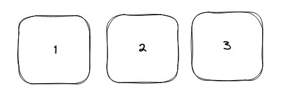
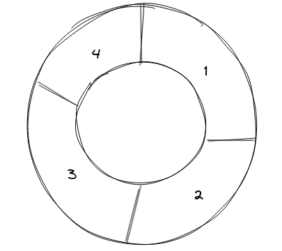
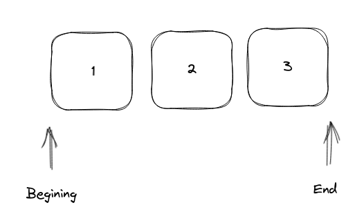
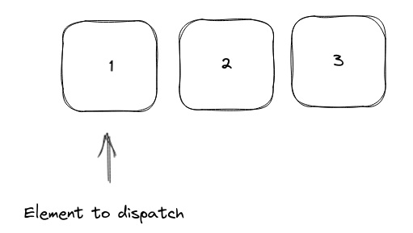
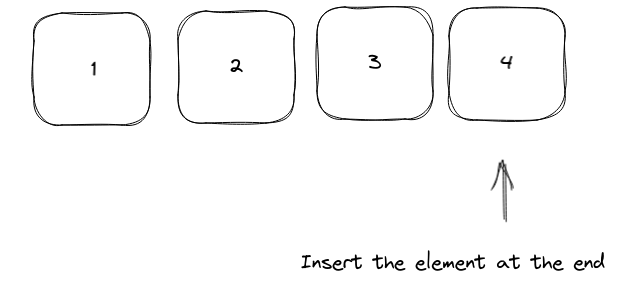

# How to Solve - Structured Queues

## Mission 5 - Create a Queue using ADT

Make a program that uses the structures and functions of Queues ADT to manage a set of points in the bidimensional plane.

The points entity must have the following structure:

```json
{
    "ID": "P01",
    "x": 1.333,
    "y": 1.333,
    "isValid": true,
}
```

While the Queue entity must have the following structure:
```json
{
    "points": [],
    "last": -1,
    "first": -1
}
```

If the Queue is **Full** or **Empty**, it must print the following messages:

* Queue is Full
* Queue is Empty

## Review - Circular Queues

At the moment you must know what is a queue and how it works.



But a circular queue is the extended version of a regular queue where the last element is connected to the first element.



In other hand, the circular queue has the same porpuse as a regular queue, but the implementation let us work with queues without moving the elements with this the circular queue help us to eliminate the major limitation of a normal queue, the overflow.

You can think of a Queue as a Stack in horizontal, but the major difference is how it dispatches the elements. When you put a new element this will always be sent at the end, and when you dispatch the element you will always dispatch the element at the begining.

To ilustrate this, here its an image that shows where is the begining and where is the end



When you **pop** an element, this will be the first one.



When you **push** an element, this will be at the end



The circular queues work in the same logic, but they use two flags **start** and **end**, these flags will only point the index at where is the first and last element.

And using this flags we can optimize the performance whenever our queue has a limit, also it allows us to not move the elements in an array, and instead of that just flag where the following element will be inserted.

It will confuse you more if I explain it here, so in the next objectives you will be creating a circular queue, take some time to understand the code so you can understand the purpose of manipulating the data in this way. For example, try to figure how much time will it take to dispatch one element and iterate in the array to move the elements one index behind.

## Objectives

Let's have a brief example of a Queue, Margot opens a store, so she needs a system for the customes, where the first to get to the cash register, is the first to be dispatched, and the last person to get is the last person to dispatch.

```json
{// Person
    "turn": 1
}
```

```json
{// QueueRegister
    "persons": [],
    "size": 10,
}
```

### Objective 1. Re-learning Data structures

First we need to convert the previous structure to code, so it will be like:

```c++
typedef struct {
    int turn;
    bool isValid;
} Person;

typedef struct {
    Person *persons;
    int size;
    int first;
    int last;
} QueuePersons;
```

Stop, have you noticed? we added in each object extra features, like we do for the stack in the previous exercise.

**isValid** will tell us if the Person is a valid person or if it is a Invalid Person.

**first** and **last** will help us to determine how to dispatch the queue and also to tell us if the Queue is Full or Empty.

### Objective 2. Initializing our Queue

The first thing our code need is to initialize our structure, so our main function will be like:

```c++

int main()
{
    QueuePersons qu;
}
```

And that's all!

### Objective 3. Let's initialize the Queue Persons

We need to define all the parameters of our Queue Persons, so we need to fill the following function:

```c++
void ClearQueuePerson(QueuePersons *q, int size)
{
    q->persons = new Person[size];
    q->size  = size;
    q->first = -1;
    q->last  = -1;
}
```

### Objective 4. Passig data by reference

Well you must be aware now, that 

```c++
ClearQueuePerson(qu, 10);
```

is not working...

So you must remember, we need to pass by reference and to do so, we need the &, if you are having doubts right now, I recommend you to check Objective 4 of How to Solve - structured Stacks.

```c++
ClearQueuePerson(&qu, 10);
```

Will do the trick.

### Objective 5. Someone wants to be in the Queue

#### Step 1. Create a Person Object.
For add a new Person to the Queue we need a function that creates the Person:


```c++
Person createPerson(int turn, bool isValid)
{
    Person elem;
    elem.turn = turn;
    elem.isValid = isValid;

    return elem;
}
```

#### Step 2. My Queue is full?

We need to undestand how to check if the Queue is Full, our Queue is a circular Queue, that means, our last element will be behind the first one.

But the problem is that, the first element can be at index 0, or can be in the last index of the array, so we need to check correctly where it is.

Think by yourself a moment, if you don't have a clear answer at the moment look at the following code and try to understand what it does. And the purpose of being like that.

```c++
bool isFull(QueuePersons q)
{
    return (q.last + 1) % (q.size) == q.first;
}
```

### Step 3. Go to the end please

Finally, after a long journey we can add a person to the end of the queue

```c++
bool push(QueuePersons *qu, Person elem)
{
    if (isFull(*(qu))) {
        return false;
    }

    // Handle first item
    qu->first = qu->last == -1 ? 0 : qu->first;
    qu->last = ++qu->last % qu->size;
    qu->persons[qu->last] = elem;
    return true;
}
```

You can see that the push function is the same for a stack, but you will see that there is only one line that is added, that is because we need to check what will be the next last index. So we need to add one index and also validates that is in the range of the size of the queue.

#### HOLD ON, WHAT??

Yes, you may be wondering why I'm using short expressions, or maybe you don't know them already.

But don't worry young padawan, i will let you understand a little more about this, that is like heaven for programmers.

Yeah, you may be wondering, that it's not something awesome, because in reality it isn't. Many times, when we ask a **if - else** statement, we only have one line in each block.

Think that we need a function that receives a boolean, and if its true return 1, else return 2.

```c++
int returnInteger(isTrue) { // Long...
    int i = 0;

    if (isTrue) {
        i = 1;
    } else {
        i = 2;
    }

    return i;
}

int returnInteger2(isTrue) { // Short and nice.
    return isTrue ? 1 : 2;
}
```

As you can see we can also remove the declaration of a variable.

But what is the purpose of this syntax, well, it's only used because we want shorter code, that means less key strokes in the keyboard.

But you are free to use short expressions or **if - else** statements. Also if you have more lines in each if block, then the short syntax cannot be used. Because it will cause that the readibility of the code to be horrible. So use it wisely whenever you need and know that is only for the purpose of assigning a value based on a flag.

In other hand we have the **%** operator, this operator is like the division, but it will return the integer remainder.

```c++
{
    int i = 4; int size1 = 8;

    int j = 3; int size2 = 2;

    printf("%d", i % size1); // 4
    printf("%d", j % size2); // 1
}
```

What **%** (modulo operator) does is a division, but instead of returning you how many times can be divided, it returns you the remainder of that division.

### Objective 6. Next Please!

#### Step 1. Is anyone in the queue?

For understanding if a queue is empty, we need to understand when its empty, remember that if one element is existent, then the last flag will be at their index. But how can we use the flag to point that the queue is empty? It's easy, if our last element is at index -1, then the queue is empty.

```c++
bool isEmpty(QueuePerson qu)
{
    return qu.last == -1;
}
```

#### Step 2. We have another problem... Houston

The pop function differs from an stack, yeah, you need to return the first element in the array, then move all the array one space.

```c++
Person pop(QueuePersons *q)
{
    if (isEmpty(*(q))) {
        return createPerson(0, false);
    }

    Person p = q->persons[q->first];

    // Handle last item 
    if (q->first == q->last) {
        q->first = -1;
        q->last  = -1;
    } else {
        q->first = ++q->first % q->size;
    }

    return p;
}
```


### Objective 7. We need Control!

As you may noticed, you are testing individual functions, we need to control what we want to do (add, remove, initialize, exit). So we need to add a little control to our main function, this time will be on my count the control logic, complement with all your work!

```c++
#include <stdio.h>

// ... functions, headers, etc.

int main() {
    // ... initialization
    int order;

    do {
        // Get Order from the user
        scanf("%d", &order);

        switch (order) {
            case 1: // Initialize Queue
                break;
            case 2: // push
                // retrieve info from user input
                // insert
                // was correctly inserted?
                break;
            case 3: // pop
                // retrieve last person
                // display the person
                break;
            default: // print "Unknown Order"
                break;
        }
    } while (order != 4);

    return 0;
}
```