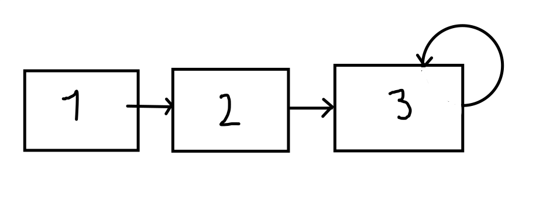

# How to Solve - Stacks - Simply Linked Lists

## Mission 6 - Create a Stack with Simply Linked Lists

Make a program that simulates a stack using Simply Linked Lists




This mission is the same as the Mission 5, but we are going to face the challenge of changing from one structure to another.

As a recap, we have the TPoint Structure as following:

```json
// TPoint
{
    "ID": "P01",
    "x": 1.3,
    "y": 2.0
}
```

We don't need any other structure, the difference is that in Mission 5 we use another structure as a controller for the Stack, but in this mission we only need the TPoint structure.

### Objective 1 - Initializing the Stack

We need to create something similar to a Stack structure:

```c++
// First declare the structure that will store our data
struct node {
    int x;

    // Remember this line is important, is what defines what is the following item
    struct node *next;
};

// Secondly we declare another structure as a Stack
typedef struct node *Stack;

int main () {
    // We declare myStack variable
    Stack myStack = NULL;

    return 0;
}
```

At this moment you must have made the corrections to save all the necessary information, and with the previous fragment of code, now you have a boilerplate of the Simply Linked Lists.

### Objective 2. Next, please

We have the structure, now we need to put elements in the Stack, remember the logic for Simply Linked Lists

```json
{
    "ID": "P01",
    "x":  1,
    "next": {
        "ID": "P02",
        "x":  2,
        "next": null
    }
}
```

The flag `next` is pointing to another element. Also that element can be pointing to another or null. But we are not pointing directly to the data, we are pointing on the position where the data is stored.

*Some prefer to point next to the same element, instead of null, because null can cause other problems.*

We need to add a new point to the stack, for that we need to fill the following function:

```c++
void push(Stack &stack, int x) {
    // Create a new node and push it to the stack
}
```

That instruction is kind lame, and we need to deepen more to understand how to do that instruction.

Firstly, we need to consider this:

1. If the Stack is empty, then my element will be the stack
2. If the Stack is not empty, then I need to iterate in each element until I can put the values at the end.

But how can we iterate over a Stack?

```c++

// Why using & See comments below function (1)
void iterator_example(Stack &stack) {
    Stack iterator;

    iterator = stack;

    // While there is a element in next
    while (iterator->next != iterator) {
        // We make iterator the following element
        iterator = iteraton->next;
    }

    // Once it's done, in this moment we are at the end
}

// Notes:
// 1.- Why are we passing a variable with the &, and not with the *?
// ---- Well, in some languages & is reserved to pass a data by 
//      reference and not by value, so this means, any changes made in
//      the function will be in the final information.
// 2.- Pass by references is pointing to a index in memory, normally 
//     functions receive a copy of the values and this is pass by value.
```

And how we add a value to an empty Stack?

```c++
void adding_values(Stack &stack, int x) {
    // We create a new element
    Stack item = new (struct node);

    // We add the required values to the element
    item->x = x;
    item->next = item; // sentynel linked list

    // If the stack is empty, we make the element our stack.
    if (stack == NULL) {
        stack = item;
    }
}
```

Ok, and how can I add a value to a stack that has elements?

Well, thats quite easy, and can't show you in code how because then I will give you the full answer of this objective, but I can explain you.

First, you need to check that in fact, the stack is not empty.

Second, you must iterate over the elements of the stack, until you are in the last item.

Third, the last item will be pointing to itself or to null, depending on which logic you decided. So you only need to put this line:

```c++
iterator->next = item;
```

With that line, the last item in our stack is now pointing to another item, so we have added successfully an item to our stack.

### Objective 3. Pop!

Lastly, we need to get the last item of our stack, in Objective 2. was detailed many of the tasks to do in order to add an item, so some part of the code will be reutilized to create the following function:

```c++
void pop(Stack &stack) {
    // Validate that the stack is not empty

    // Iterate in the elements until you get at the final element
        // print the final element
        // remove the final element
        // the previous element -> next will be pointing now to null
}
```

As you can see we have mostly all of the code, the element of code remaining is how to remove the element. For that we need another thing, a temporary element.

```c++
Stack iterator, temp;
```

This temporary element, will help us to update the semi final element to point to NULL, also we need a new instruction `delete`.

```c++
delete(iterator);
```

With the instruction above we will be able to delete from the memory the last element.

With that in mind our pop function is defined by the following algorithm:

1. While iterator != NULL
    1. If iterator->next == iterator
        1. If that was the only element in the stack
            1. Stack = NULL
        2. Else
            1. temp->next = temp;
        3. delete iterator
        4. break
    2. Else
        1. temp = iterator
    3. iterator = iterator->next

### Objective 4. More Controls

As the previous exercise we need the same logic of controlling the flow of data. so again you must complete the main function:

```c++
int main() {

    int order;

    do {
        // Get Order from the user
        scanf("%d", &order);

        switch (order) {
            case 1: // Use Push()
                // ID = "ID" + index of item (Generate yourself)
                // x = Get from user
                // y = Get from user
                break;
            case 2: // Use Pop()
                break;
            default: // print "Unknown Order"
                break;
        }
    } while (order != 4);

    return 0;
}