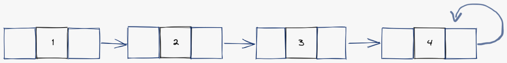

# How to Solve - Stacks - Simply Linked Lists

## Mission 6 - Create a Stack with Simply Linked Lists

Make a program that simulates a stack using Simply Linked Lists

This mission is the same as the Mission 5, but we are going to face the challenge of changing from one structure to another.

As a recap, we have the TPoint Structure as following:

```json
// TPoint
{
    "ID": "P01",
    "x": 1.3,
    "y": 2.0
}
```

We don't need any other structure, the difference is that in Mission 5 we use another structure as a controller for the Stack, but in this mission we only need the TPoint structure.

### Exploration - Simply Linked Lists

What is a Simply LInked List? Well, we can look at the following image as a reference.

As you can see is a list of items that are connected only on **one way**, also the last item can be pointing to itself (as in the image) or to NULL.



You can see this structure as the same way you can see an array, but the greater difference is that this structure of data can let us create dynamic arrays, in other manner of saying. We can create a list of 100, 200 or 300 elements without changing a single line of code.

This connection is to say, which element is after which element, and with that connection we can handle the simply linked list, to remove or add any element.

But this interface has its limitations, as you will see while reading and in the following manuals.


### Objective 1. Let's STRUCTure our stack of NODE

For this example we will be working with nodes, the nodes will have the following structure:

```json
{// node
    "x": 1
}
```

In C++ we will need to structure this data, also we need to structure in a way so we can simply link this node to another. So the result is the following code:

```c++
struct node {
    int x;
    node *next;
};
```

Quite easy isn't?

#### Pro-Coding Tip 101

For this exercise, since the stack is dynamic, from one moment to another our stack can be full, this is because a computer have a limit on memory, if we add thousands and thousands of nodes, in one moment our code will fail since it will not be able to create a new node, so in the next objective we will create a node and validate the overflow of memory.

Also since many internal functions are added on the standard namespace, it is possible that you don't want to write `std::some_function`, more disgusting if you have to write 100 times the sentence, so you can save some keystrokes using the following line of code:

```c++
using namespace std;
```

With this you can use cout or cin without writing `std::cout` or `std::cin`

### Objective 2. Let's push a node.

You must know that the push function returns an status, true or false, this status indicates if an element was inserted into the stack. We are working with dynamic stacks, so we can run out of memory, but to avoid our program from breaking itself, since it can have sensible data and we can't afford to lose that data, we need to try and catch the error.

Our push function will be look like:

```c++
bool push(struct node *&stack, int x)
{
    try {
        // Create the node
        struct node *item = new node;
        item->x = x;
        item->next = item; // points to itself

        if (stack == NULL) {
            stack = item;
        } else {
            // We need to iterate over the elements to reach the end of the stack
            struct node *iterator = stack;

            // If the following is not the same
            while (iterator->next != iterator) {
                iterator = iterator->next;
            }

            // Put the node at the end of the stack
            iterator->next = item;
        }

        return true;
    } catch (bad_alloc& ex) {
        return false;
    }
}
```

Isn't pretty? The fragment of code above, can be considered the difficult way.

Why? well you need to think, this stack is using the ->next to indicate the top of the stack. But in reality, we know that the top is what is at the highest position, but in code, it is really necessary to put the top at the end?

If you are not getting the idea, think from another angle, will it be easy to put the first element as the top, and put the stack in the ->next of that element, once we get to the pop you will understand why it's more difficult on this way. But I think it would be great if you can build by yourself the easiest way, this is why I presented the hardest one, so you can think by yourself on these things that maybe are not wrong, but can be aborded in a different way.

Also you must have noticed something whe are using `*&stack`, why? well think that with * we are declaring in some way a dynamic array, and you already know we use & to indicate that we are passing by reference.

### Objective 3. Let's Pop and Roll

Our pop function is the same as always, it must return a `struct node *item`, this item can be a valid one or can be NULL, if it's NULL this indicates that the item is not valid, and the stack is empty.

Remember that with the following code, you must understand why it's the hardest one, maybe not in code, but in performance this can be very hard if the stack keeps increasing.

```c++
struct node * pop(struct node *&stack)
{
    if (stack == NULL) {
        return stack;
    }

    // You already know that we need to iterate to the end of the stack to reach the top.
    struct node *iterator = stack;
    struct node *previous = NULL;

    while (iterator->next != iterator) {
        // We assign the previous to be the previous element
        previous = iterator;
        iterator = iterator->next;
    }

    // If our stack has only one element we set the stack to empty
    if (stack == iterator) {
        stack = NULL;
    } else { // otherwise set the previous element to point to itself
        previous->next = previous;
    }

    return iterator;
}
```

You have already seen right? It's the hardest way because we need two iterators instead of none, using the beginning as the top will allow us to put the following line `stack = stack->next`, using the end as the top will force us to think in a way that we can let top - 1 element to point to itself on a pop.

### Objective 4.- No more help, nono.

In previous exercises I give you the main function to only add the functions that you will need to use, in this case I will only give you a few instructions.

#### Tip. 1 - Declare the stack
```c++
struct node *stack = NULL;
```

#### Tip. 2 - Retrieve elements from the stack
```c++
struct node *item = pop(stack);
```

And that's all folk.

### Objective 5. The easiest way - the path of the software engineer.

As I told you before, there is an easy way to create a simply linked list stack, on this way you can ensure that you application will not lack in performance with the operations for push and pop.

The only tip that I can provide you is the declaration of an structure than will help you when you are writing your code.

```c++
struct node {
    int x;
    node *down;
};
```

Why `down`? well it's easy, what is below the item on the top? another `item`