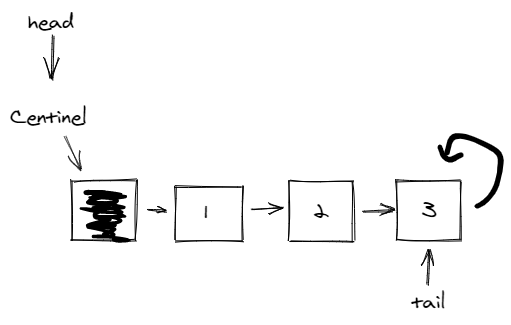
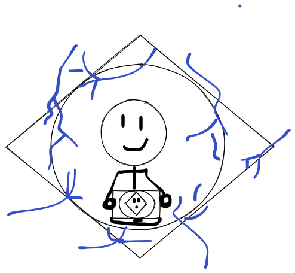
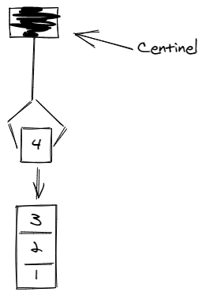
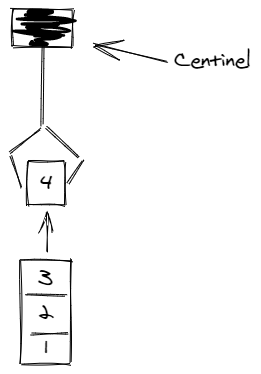

# How to Solve - Stack - Simply Linked Lists

## Mission 6 - Create a Stack with Simply Linked Lists

Make a program that simulates a Stack using Simply Linked Lists

The Structure required for acomplishing this Mission is the following.

```json
{ 
    "ID": "P01",
    "x": 1.300, // 3 floating points.
    "y": 1.250
}
```

As always, this guide will help you to accomplish this mission.

### Scout Boy Exploration - Simply Linked Lists

What is Simply if not something easy? A Simply Linked List is a data structure that will help you to create dynamic lists. Also this structure will help you to understand the importance of the order, or the logic required to accomplish performance.

You can see the following image to understand a Simply Linked List.



As you can see you have a `centinel`, the `centinel` is an invalid object of the Simply Linked List, this object will help us to do insertions in the head or in the tail.

In the image are two simple linked lists, the first one is with a centinel in the tail, and the other is with a centinel in the head. The great difference on where to put the centinel consists on the logic required to insert a new element, since is differente insert an element after the head, and insert an element before the tail.

In great resume the Simply Linked List are nodes that are connected between them in only **one way**, and let us iterato over the elements to reach the head or the tail.

#### Objective 0. It's tutoring time!



For this guide we will be creating a Stack for the following Point structure:

```json
{
  "x": 1
}
```

We want to achieve the most basic operations of a Stack.

1. Create a Node for the Stack
2. Initialize our Stack
3. Insert a new Node to the Stack
4. Pop a Point from the Stack

#### Objective 1. Defining our structure

We will be using the following template for the code session:

```c++
#include <iostream>

using namespace std;

int main()
{
  cout << "Hello World!" << endl;
  return 0;
}
```

First we need to create the structure for the Point datatype.

```c++
typedef struct Point {
  int x;
} Point;
```

After creating our Point structure we need to create the Structure for each Node of the Stack.

```c++
struct Stack {
  Point p;
  Stack *next;
};
```

#### Objective 2. Create a Node for the Stack

What the? Are not we using a Point Structure? Yeah, but we are not storing only the value of x, imagine we are using the TPoint structure defined in the exercise, yes the one with ID, X and Y. We can put that values in the struct for the Stack, but when we need to use the data stored in the Stack node, we need to retrieve all the Stack node.

And as you can guess, the stack node will be pointing to another nodes. 

So Imagine that by a unaware use of the Node, someone ends erasing or changing the node, we can miss which node was pointing, we can loss tons of data.

So that is the reason why we are separating the node from the element that we want to store. So, let's start!

```c++
Stack *CreateNode(Stack elem)
{
  Stack *aux = NULL;

  // Check if we can create a new node
  if ((aux = new Stack[1]) == NULL) {
    return NULL;
  }

  // Set the values in the node
  *(aux) = elem;

  // The node will be pointing to itself
  aux->next = aux;

  return aux;
}
```

As you can see the main objective of the function is try to create a node, if the node cannot be created return a NULL, otherwise return the new node with the elements that we need in the node.

#### Objective 3. Initialize the Stack Centinel

As you will see in the following code examples we will be using a centinel in the head. Why? You will see, that in operations like push or pop we can optimize the performance of our application by doing this.

```c++
bool CreateStack(Stack **head)
{
  Stack *CenHead;
  Stack aux;

  // Create a Head Centinel using a Stack item
  CenHead = CreateNode(aux);
  // If the Centinal cannot be created return false
  if (CenHead == NULL) { return false; }

  // The centinel will point to itself
  CenHead->next = CenHead;

  // Our head will be the Centinel
  *(head) = CenHead;

  return true;
}
```

You can see that this is an easy example, with the Create Stack we are initializing our head centinel. With the centinel we will be able to insert elements.

But remember, not always go as planned so you will need to validate that the centinel can be created.

#### Objective 4. Push it in the top

Our main goal is to achieve the following functionality, we need to put our element after the centinel, so we can have something like this:



You may be seeing that this is pretty similar to stacking elements to create a tower.

For pushing an element into the stack we need to go a little deeper, we need to start with creating our element to insert, that is done using the following code:

```c++
Stack *head; 

bool canBeCreated = CreateStack(&head);

if (canBeCreated) {
  Point p;
  p.x = 2;

  Stack elem;
  elem.p = p;

  // Push
}
```

And only with that we have created a new element, but we need to push this element into the stack:

```c++
bool pushNode(Stack *head, Stack elem)
{
  Stack *newItem = NULL;

  // We try to create a new node for the stack
  if ((newItem = CreateNode(elem)) == NULL) {
    return false;
  }

  // Check if there is an element in the stack aside of the centinel
  if (head != head->next) {
    // Connect new item with the previous item
    newItem->next = head->next;
  }

  // Connect the centinel with the new element
  head->next = newItem;

  return true;
}
```

And that's all, pretty easy isn't?

BUT, there is another way to insert the element, you have seen the "performance" way, and this type of insertion is insertion on the head. There is another insertion type called insertion on the tail. And as you can guess, this insertion is done by connecting the last element to the new element (Yes, you need to iterate over all elements to reach the end of the stack).

You can try if you want, but take into account that this will lead to bigger times on the insertion, well only if you have a big number of elements in the stack. If you only manage 5 elements it will be difficult to have that leak of performance.

Ah and how can you use the pushNode()?

```c++
// ...Push
bool canBeInserted = pushNode(head, elem));
```

#### Objective 5. The Claw!




As always the pop function should return the point and a boolean to know if the item has been dispatched correctly.

```c++
Point popNode(Stack *head, bool *isValid)
{
  Stack *iterator = head->next;
  Point elem; 

  // Check if the item is not the centinel
  *isValid = head != iterator->next;

  // Get the element that you want to 
  elem = iterator->p;

  if (iterator != iterator->next) {   // If the item has a next
    head->next = iterator->next;      // Centinel points to the item->next
  } else {
    head->next = head;                // Otherwise Centinel points to itself.
  }

  return elem;
}
```

We need to check that our Point element is a valid one and not the centinel, also when dispatching elements we need to update the centinel pointer to know which element needsto point.

#### Objective 6. It's control time!

This time there is no the code for the control, you must have learned through the copy and paste.

The control must be the following:
1. Push
2. Pop
3. Clean Stack
3. Exit

**NOTE**: In the exercises maybe are extra options, these options are quite easy once you understand, since these options are to print the item or the list of items. Quite easy, so in these manuals these functions are not included.