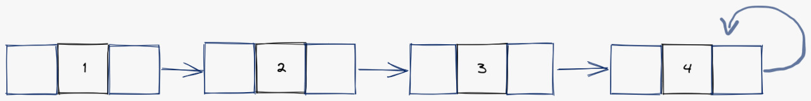

# How to Solve - Queues - Simply Linked Lists

## Mission 7 - Create a Queue with Simply Linked Lists

Make a program that simulates a Queue using Simply Linked Lists

As a recap, we have the TPoint Structure as following

```json
{ 
    "ID": "P01",
    "x": 1.300, // 3 floating points.
    "y": 1.250
}
```

We don't need any other structure, the difference is that in Mission 5.2 we use another structure as a controller for the Queue, but in this mission we only need the TPoint Structure.

### Exploration - Simply Linked Lists

What is a Simply LInked List? Well, we can look at the following image as a reference.

As you can see is a list of items that are connected only on **one way**, also the last item can be pointing to itself (as in the image) or to NULL.



You can see this structure as the same way you can see an array, but the greater difference is that this structure of data can let us create dynamic arrays, in other manner of saying. We can create a list of 100, 200 or 300 elements without changing a single line of code.

This connection is to say, which element is after which element, and with that connection we can handle the simply linked list, to remove or add any element.

But this interface has its limitations, as you will see while reading and in the following manuals.

### Objective 1. STRUCTuring our Queue of Nodes

For this example we will be using our dear node structure, the node will have the following structure:

```json
{// node
    "x": 1
}
```

In C++ we will need to structure this data, also we need to structure in a way so we can simply link this node to another. The result of our structure is the following:

```c++
struct node {
    int x;
    node * next;
};
```

Beautiful as always.

### Objective 2. Stop PUSHing me!

If you remember the Queue to buy your lunch on high school, everyone will be pushing to be the first one.

Be glad, our queue will be only one way and nobody will push you.

So, our queue needs a push function, as always the push function must return a boolean value that will be a flag to indicate if the value was correctly pushed into the queue.

```c++
using namespace std;

bool push (struct node *&queue, int x)
{
    try {
        struct node *item = new node;
        item->x = x;
        item->next = item;

        if (queue == NULL) {
            queue = item;
        } else {
            struct node *iterator = queue;

            while (iterator->next != iterator) {
                iterator = iterator->next;
            }

            iterator->next = item;
        }

        return true;
    } catch (bad_alloc& ex) {
        return false;
    }
}
```

Wait! is the same function that uses the difficult stack? Ding Ding Ding! Yes it is.
The improper way of the stack, is the proper way of the queue.

If you are wondering why, you must see the pop function. :)

### Objective 3. It is beautiful

As always the pop function should return the node, or null if the item is not a valid one.

```c++
struct node * pop(struct node *&queue)
{
    if (queue == NULL) {
        return queue;
    }

    struct node *item = queue;

    if (queue->next != queue) {
        queue = queue->next;
    } else {
        queue = NULL;
    }

    return item;
}
```

You see? This is why the Queue is the simplest one, our pop function doesn't need to iterate anything. We just need to validate if is the last element on the queue, if it is our queue returns to an empty indicator.

### Objective 4. Reusing our control function

This time there is no the code for the control, you must have learned through the copy and paste.

The control must be the following:
1. Push
2. Pop
3. Exit

**NOTE**: In the exercises maybe are extra options, these options are quite easy once you understand, since these options are to print the item or the list of items. Quite easy, so in these manuals these functions are not included.