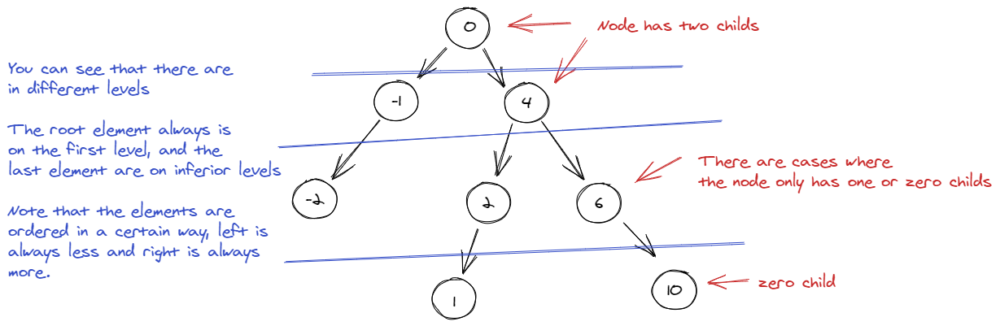
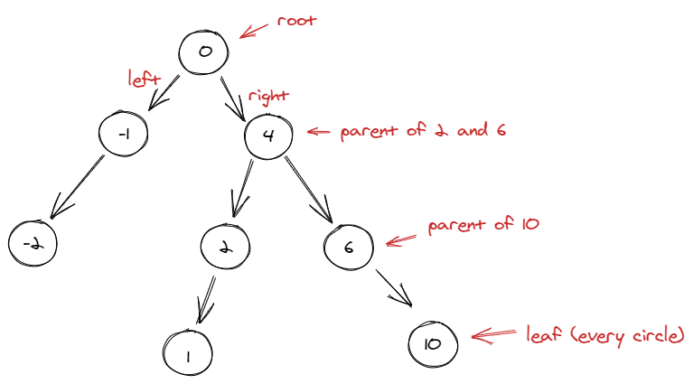
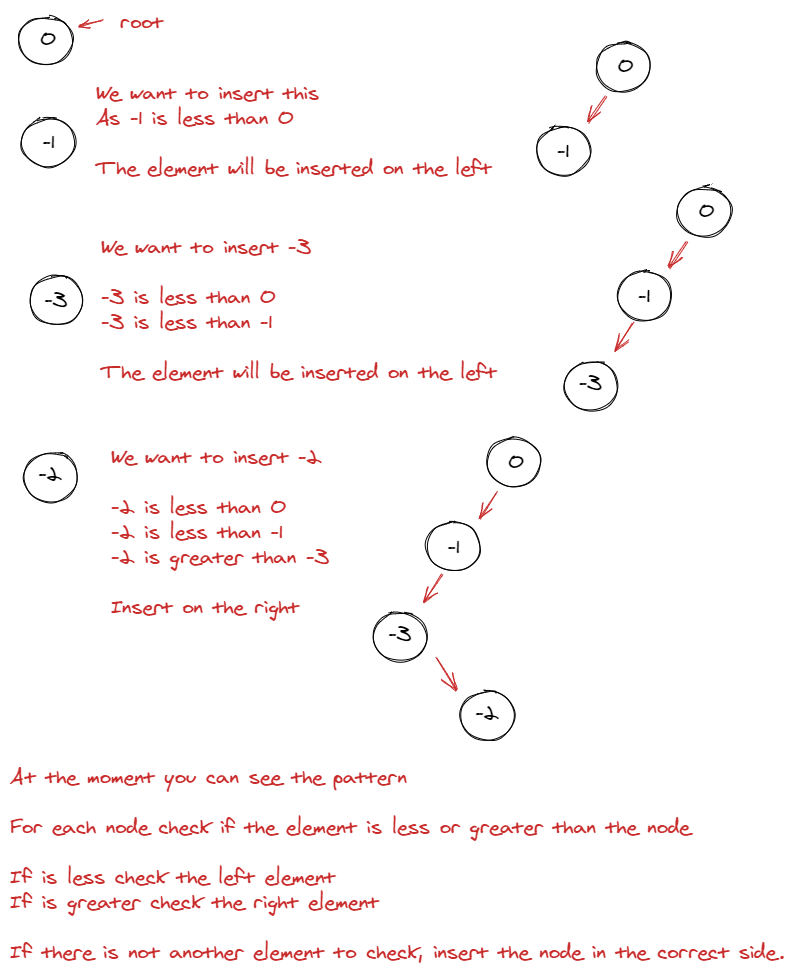
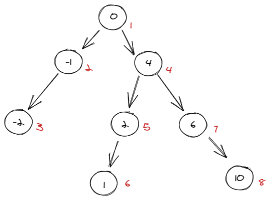
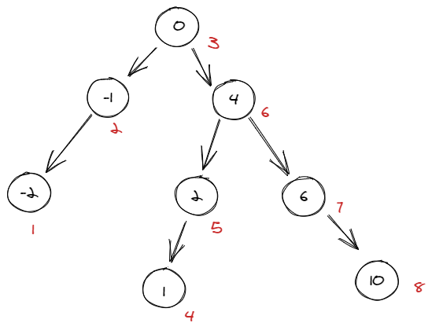
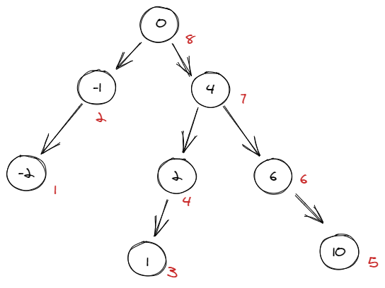

# How to Solve - Binary Trees

## Mission 09 - Yggdrassil

You must be wondering, what is a binary tree? Let me explain.

A Binary Tree is data structure in which each node has at most two children, these constantly are refered as **left** and **right**. (See image below).



Two children is the reason this is called binary. The Binary Tree consist in many parts as described in the following image.



## Objectives

### Objective 1. Creating the Structure

To start working with nodes we need a structure that can accomplish the following:

1. Each node has a parent
2. Each node has two leafs (left and right)
3. Each node needs to store data.

First thing we will accomplish the third point.

As always the data that we will use is the most simple:

```c++
typedef struct node {
  int x; // <-- data
} node;
```

Think of it, if we need to store more data, like the information of a person is better to create an structure for the data and just use that structure on the node.

Now we can advance and do step 1 and 2. And as you can guess this is not complex at all since it's something that we are using all the course.

```c++
typedef struct node {
  int x;
  node *parent;
  node *left;
  node *right;
} node;
```

And this is all you need to start working on the next objectives.

### Objective 2. Every Tree has a root.

Yes every leaf in the binary tree has a parent, except for the root, in this particular case the root parent is always itself.

So we need a funtion that prepares each leaf for us:

```c++
node *createNode(int elem) {
  node *aux = NULL;

  // Try to create the node
  if ((aux = new node[1]) == NULL) {
    return NULL;
  }

  // If the memory can be used save the data and return the element
  aux->x = elem;
  aux->parent = aux;
  aux->left   = NULL;
  aux->right  = NULL;

  return aux;
}
```

Ok, for the moment we have a node for our Binary Tree, but we still don't have a root, that can be accomplished in the following way.

```c++
int main()
{
  node *root = NULL;

  // This is an example, think that the first element
  // will only be inserted with the user input

  int val = 0; 

  if ((root = createNode(val)) != NULL) {
    // You now have a root.
  } else {
    // The root cannot be created
  }
  
  return 0;
}
```

### Objective 3. The tree is growing

For this objective we will be centered on how to add leafs to our tree, at the moment we have the code to create a root.

```c++
int main() {
  // ...
    // You now have a root.
      // We need to create another node
      // Check where will be inserted, in the left or right branch.
  // ...
}
```

With this we need to define a little bit the parameters that we will be using:

1. node *leaf (With this we can check if the leaf is empty or has data)
2. node *parent (We need it to link the parent to the children)
3. int elem. (Nothing to discuss is just data)

The insertion that we are trying to achieve is a ordered insertion, with this we only need to iterate over the branches to print the data in a sorted way.



With all this we can start!.

```c++
bool insert(node *leaf, node *parent, int elem)
{
  // If the leaf is empty
  // and there is no parent, we cannot continue (data will be missing)
  if (leaf == NULL && parent == NULL) {
    return false;
  }

  // if the leaf is empty we can insert the node
  if (leaf == NULL) {
    // try to reserve memory
    node *aux = NULL;

    if ((aux = createNode(elem)) == NULL) {
      return false;
    }

    // link parent with children
    aux->parent = parent;

    // yes we have the leaf, but the parent 
    // otherwise will not be correctly linked.
    if (aux->x > parent->x) {
      parent->right = aux;
    } else {
      parent->left  = aux;
    }

    return true;
  }

  // If leaf is not empty try to look where to allocate the new node.
  if (elem > leaf->x) {
    return insert(leaf->right, leaf, elem);
  } else {
    return insert(leaf->left, leaf, elem);
  }
}
```

Maybe you don't know what a recursive function is, so I will explain it:

```c++
// Think in the following function

int addOne(int elem) {
  if (elem > 5) {
    return elem;
  } else {
    return addOne(elem + 1);
  }
}

// This function takes a integer, if the integer is greater than 5 
// it will be returned, otherwise will be increased in one
// until it reaches 6

printf("%d", addOne(6)); // 6
// what happen there is:
// 6 > 5 = true : return 6

printf("%d", addOne(3)); // 6
// Explaining what happen in this case is:
// 3 > 5 = false; 4 > 5 = false; 5 > 5 = false; 6 > 5 = true : return 6
```

A recursive function always has one condition that interrupts the endless loop so it can finish, but keep aware of this, what will happen if i put -100000 in the function? it will call too many times the same function and it can cause the application to crash due to a excess in the memory. So keep in mind that this kind of function should only be used when we are sure that there will not be too much recursion. 

### Objective 4. Printing Machine

There is three ways of printing the values in the Binary Tree:

1. Pre Order
2. In Order
3. Post Order

#### Pre Order

The following graph will explain how it will be printed:



```c++
void PreOrder(node *root) {
  cout << root->x << endl;
  PreOrder(root->left);
  PreOrder(root->right);
}
```

#### In Order
he following graph will explain how it will be printed:



```c++
void InOrder(node *root) {
  InOrder(root->left);
  cout << root->x << endl;
  InOrder(root->right);
}
```

#### Post Order
he following graph will explain how it will be printed:



```c++
void PostOrder(node *root) {
  PostOrder(root->left);
  PostOrder(root->right);
  cout << root->x << endl;
}
```

#### Wrapping all

Yes, you can only have one function that does the three types:

```c++
void Print(node *root, int type) {
  if (root != NULL) {
    switch (type) {
      case 0:
        cout << root->x << endl;
        Print(root->left, 0);
        Print(root->right, 0);
        break;
      case 1:
        Print(root->left, 1);
        cout << root->x << endl;
        Print(root->right, 1);
        break;
      case 2:
        Print(root->left, 2);
        Print(root->right, 2);
        cout << root->x << endl;
        break;
    }
  }
}
```