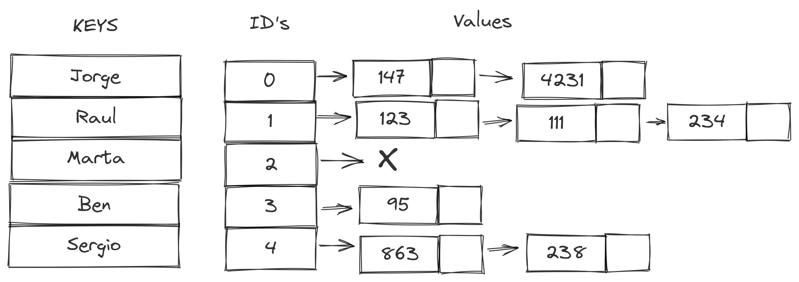

# How to use a Hash Tables

## Mission 10 Make a search with Hash tables

First we have to create our node structure, and fill it. 


```C++
{ 
    char Nickname[30]; // Put a size for our node 
    NodeHash *prev; // Prev node 
    NodeHash *next; // Next node 
}
```

As always, this guide will help you to accomplish this mission.

The hash table belongs to the category of dictionaries that are data structures and algorithms that allow searching, inserting and discarding elements. 

This is how a Hash table looks like: 



But how it works?.

When we use a hash table, we assign a specific memory space to store information, we use a Hash function which consists of getting the best value to store it. 

### Hash Function: 

To make the hash function we use Sumatory of the ASCii id letters in the string and we make a mod using the size of our memory space, this will give us a memory id to store our elements. 

```C++
{ 
// 
}
```

### Insert 

??

```C++
{ 
// 
}
```

### Search 

?? 

```C++
{ 
// 
}
```