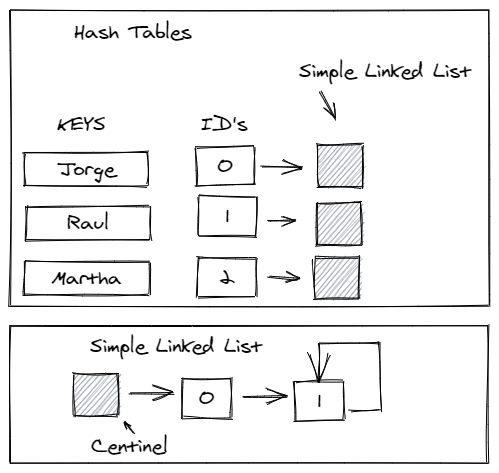
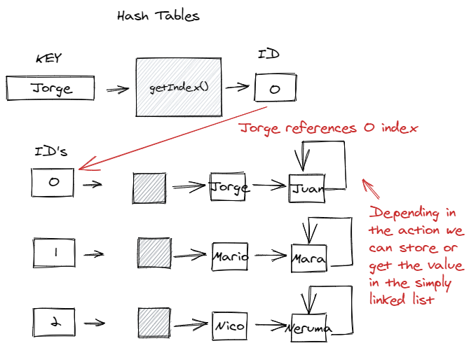
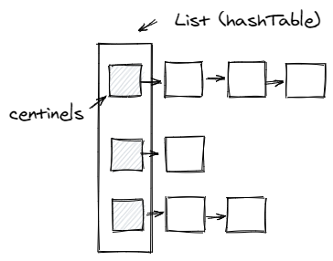

# How to Solve - Hash Tables

## Mission 10 - Digging into Hash Tables

As always, this guide will help you to accomplish this mission.

The hash table belongs to the category of dictionaries that are data structures and algorithms that allow searching, inserting and discarding elements. 

This is how a Hash table looks like: 


But how it works?.

When we use a hash table, we assign a specific memory space to store information, we use a Hash function which consists of getting the best value to store it. 

### Scout Boy - Exploration

What is a Hash Table? Well we can explain in more detail with the following image:



You can see that with a **key** we compute it with a **Hash Function** so we can obtain a **index**, and our data will be stored in that **index**. 

With this Structure of Data we can do searchs with cost O(1)

Well, let's explain furthermore, we can tell that we have a **Hash Function** (The Hash Function is a function that computes the key to obtain the index).
For this example we can say that our Hash Function is the following:

**The sum of the values in ascii** modulo **The Size of the Hash Table**

The key Maria could be in the position 5.
But, also the key airaM, note that is Maria the other way around.

In these cases we can have something called a **collision**, there are many few methods to avoid this:

1. If the index is occuped, search the next index available.
2. Change the Hash Function to avoid that Maria y airaM get the same index.
3. Use an Array to Store the data.

But, there is always a but...

1. For the first case imagine that our index is 0, 0 is occupied and we have 999 spaces, and only the index 998 is available. We need to iterate from 0 to 998 to check that the space is available. Our search method cost will become O(N). So this is not a correct solution.

2. For the second case indeed Maria and airaM will have different index, but we can have the key Jorge to have the same index that airaM, so this doesn't solve the problem in this case.

3. For the third case, we would only iterate in the same space when a collision occurs.

So you can see there is not much option to avoid collision, yes with better methods we can have less collissions, but there will be a way to get the collision.

Tablas Abiertas - Listas Simples - Dinamico
Cerradas - Array Estatico

And that's all for an explanation for Hash Tables, that can be resumed in the following image:



0 y 1 no son guarda elementos Jorge

**NOTE**: Don't forget the image only explains what usually does the Hash table, not how to prevent collision.

## Objectives

### Objective 1. Remember

We are going to return to a previous lesson, simple linked list. For the moment we need a simple linked list that accomplishes the following structure:

```json
{
  "name": "Jameson"
}
```

This is going to be the structure that we will be using as our data, for that we need to create the correct structure:

```c++
#include <iostream>
#include <string>

using namespace std;

// Structure Person
typedef struct Person {
  string name;
} Person;

int main()
{
  Person p;
  p.name = "Oscar";
  return 0;
}
```

### Objective 2. Initialize the Hash Table

With this, you can see the Person structure as the Point Structure used in the previous lessons. Now you must work on the Simple Linked List. For the moment just keep the Initialization of the Simple Linked List and the Insertion. (If you are having doubt if using a queue or a stack, don't worry use any of them).

We will use the name List to refer to the Simple Linked List.

As you must remember from the Scout Exploration, a hash table seems like a dictionary and each index has it's own simple linked list. To have a more understandable example we will create a Hash Table that uses all the characters in the alphabet.

```c++
// .. List functions and declarations
int main()
{
  //...
  List hashTable[26]; // ñ is not included

  return 0;
}
```

With only this line we have an array (or list) of the datatype List (Simple Linked List), maybe you are thinking that we are only having one item, but remember, the Simple Linked List Nodes refers to another node using pointers, so the thing that we are achieving is a matrix where the number of columns can be different in each row.



With this you have mainly everything. Now we will be explaining a little further another topics.

And yes, of course you need to iterato over each element in **hashTable** to initialize the simple linked list centinel. You have already the code to initialize the Simple Linked List so we can continue with the following objective.

### Objective 3. Hash Function

We have explained what the **Hash function** is. Is a function that receives a key and evaluates which will be the correct index for that key.

For a simple hash function we can retrieve the first character of the key and use it as the index:

```c++
int hashFunction(string key)
{
  return (toupper(key[0]) - 65) % 26;
}
```

with this we can have the index based on the first character of the key. This hash function must not be used, since it has an error with the ñ, but since is for explanation on this tutorial we will be using it.

For insertion use the push function of the Simple Linked List.

### Objective 4. Search

This is an easy job, since you already have the index where the data is stored. The only thing left is search the element in the simple linked list.

But is as easy as:

```c++
Person search(List *head, bool *isValid, string key)
{
  List *iterator = head->next; // The first element is the centinel
  Person elem;

  // Iterate until you reach the end
  // and the person name is not equal to the key
  while (iterator->next != iterator && key != iterator->person.name) {
    iterator = iterator->next;
  }

  // Check if is a valid person
  *isValid = iterator != head;
  elem = iterator->person;

  // TODO: Check if pop is required.

  return elem;
}
```

As you can see is very easy to do in a simple linked list.

And as easy as that is the hash table, the only complex in this program is that you create a correct hash function. But the actions required for this program are in majority provided by the Simple Linked List.