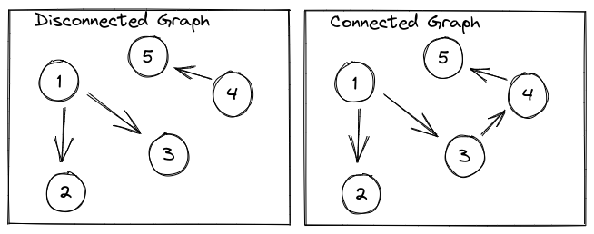
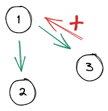
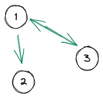
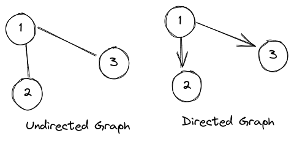
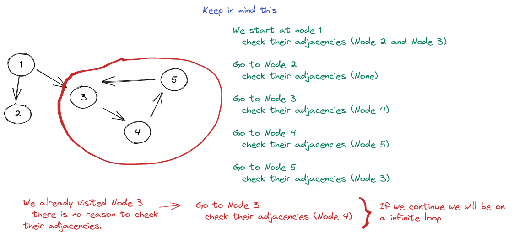
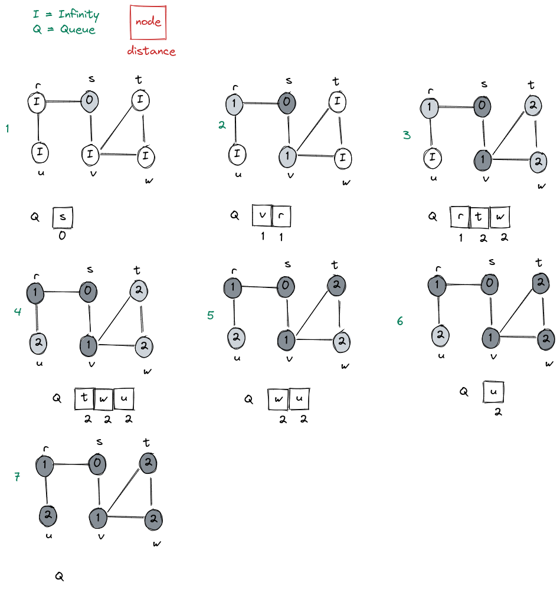
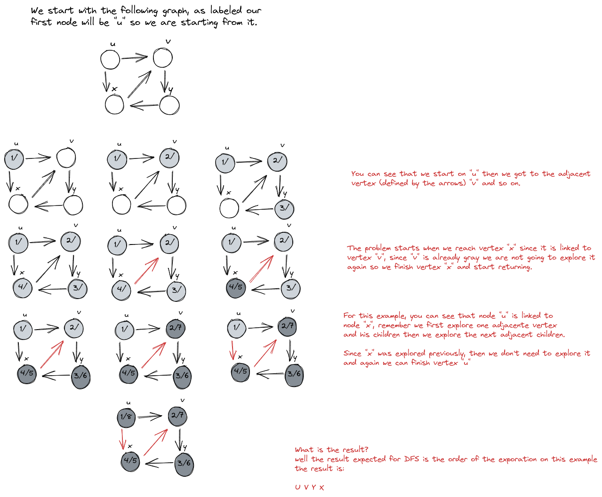

# How to Solve - Graphs

## What is a Graph?

A **Graph** ia a collection of nodes or values called __vertices__ that might be related. This **relation** between vertices is called **edges**.

Look at the image below:


If we convert this Graph into code it should look like this:

```c++
int main()
{
  int graph[5][5] = {
    {0, 2, 0, 0, 3}, // 0
    {2, 0, 2, 2, 4}, // 1
    {0, 2, 0, 5, 0}, // 2
    {0, 2, 5, 0, 1}, // 3
    {3, 4, 0, 1, 0}  // 4
  };
}
```

Yeah, I know, you must be wondering what is that matrix. See the comments in the code, each row corresponds to a vertice.

Now look at vertice 0, it is connected to vertice 1 and vertice 4. If we look at the row we have the following:

```c++
 { V0, V1, V2, V3, V4 },
 { 0,  2,  0,  0,  3  }
```

Now you can see that each value of the row corresponds to the edge with each vertice. Vertice 0 is only connected with Vertice 1 and 4, the value that we use is the **weight of the edge**.

If you think that the vertices are Stores, and the edges are the distance between them, then you can look for the shortest way for reaching Vertice 2 starting from Vertice 0. The Answer is 4, using V0 -> V1 -> V2.

Obviously with this you can also get the longest route: V0 -> V4 -> V2 -> V3 -> V5.

This is also known as **weight adjacency matrix**, there is another type of matrix called **contact matrix** the main diference is that this matrix only indicates connection.

So our graph would look like this:

```c++
int main()
{
  int graph[5][5] = {
    {0, 1, 0, 0, 1},
    {1, 0, 1, 1, 1},
    {0, 1, 0, 1, 0},
    {0, 1, 1, 0, 1},
    {1, 1, 0, 1, 0}
  };
}
```

Ok, we have desviated from the main topic, so let's continue explaining about the graphs. Until now I have give you the main elements of a graph, but not all of them.

There are two types of graphs those who are connected and those who are disconnected. Look the following image to understand the main difference between them:

;

Yes, as you can see a graph is disconnected if part of the graph is unreachable. As you can see nodes 1, 2 and 3 cannot reach by any mean to nodes 4 and 5, and viceversa nodes 4 and 5 cannot reach nodes 1, 2 and 3.

Keep in mind this since this could be a mind break when you are looking to resolve an issue using graphs.

Also, did you notice? Why did I use arrows in the previous image, but in the first image I didn't use them, well this is because the graph connections could be unidirectional or bidirectional. 

In the previous image you see that you can reach from node 1 the nodes 2 and 3, but you cannot reach node 1 from node 3.



Obviously this can be possible if the nodes 1 and 3 where connected in a bidirectional way.



**NOTE**: We are calling Bidirectional or Unidirectional but in reality, the correct name is Undirected Graph and Directed Graph.



Also keep aware of cyclic graphs, yeah don't be horrorized they are very common, and is something that you must keep aware when you are programming solutions like DFS (Deep First Search) or BFS (Breadth First Search).


Well let's review some of this. What is a Cyclic Graph?, a Cyclic Graph is when the connections lead to a node that is already visited. Let's see the following image:



With this you can see that we had some pseudo algorithm to visit all the nodes by only checking their adjacencies, but what is happening if that when there is a cycle on the graph our algorithm is stuck. This will lead to an Memory Error since we will be infinitely iterating nodes 3, 4 and 5.

## How to Initialize a Graph

Yeah we defined how a graph should like into code, in the hardcoded way, but you must remember, you cannot create a dynamic matrix, so we need at first know our vertices.

The simplest thing to do is ask how many vertices we have.

```c++
  int n;

  scanf("%d", &n);
```

The next step is to create our graph:

```c++
#include <iostream>
#include <cstring>

using namespace std;

int main() {
  // How many vertices?
  int n = 5;

  int graph[n][n]; // A matrix 5x5
  char str[100];

  // For each row
  for (int i = 0; i < n; i++) {
    cout << " Enter edges for row " << i << endl;
    cin.getline(str, 100);
    // Ex: 1,0,0,1,0

    int j = 0;
    char *ptr; 
    ptr = strtok(str, " , ");

    // Add edge values to the graph
    while (ptr != NULL) {
      // Convert to integer.
      sscanf(ptr, "%d", &graph[i][j]);

      j++;
      ptr = strtok(NULL, " , ");
    }
  }
}
```

With all this now you have a graph representation. So you can start working on some Algorithms.

### BFS (Breadth-First Search)

This algorithm is very simple to achieve, the main goal of this algorithm is to print all the graph vertices based on the level of each one, for example, taking for example the nodes of a tree, you will print the root, then print the elements in the following level, and so on.

The Algorithm is the following:

#### BFS (G, s)

1. **for** each vertex $u \in G.V - {s}$
    1. color[u]     = WHITE
    2. distances[u] = $\infty$
    3. parent[u]    = NIL
2. color[s]     = GRAY
3. distances[s] = 0
4. parent[s]    = NIL
5. $\varrho = 0$
6. ENQUEUE($\varrho$, s)
7. **while** $\varrho != 0$
    1. u = DEQUEUE($\varrho$)
    2. **for** each $v \in G.Adj[u]$
        1. **if** colors[v] == WHITE
            1. colors[v] = GRAY
            2. distances[v] = distances[u] + 1
            3. parent[v]    = u
            4. ENQUEUE($\varrho$, v)
    3. color[u] = BLACK

See the following image so you can understand better:



In the previous image you can see how the algorithm works, also you can notice? The answer for bfs is in the queue, for each DEQUEUE you do, you can print the node so effectively your answer would be:

```
S V R T W U
```

Note that this is an example, you would have a contact matrix to do this, so the answer of which node you will ENQUEUE first will be based on the row of the matrix.

As you can see this is very simple and can be handled directly using 3 arrays, to have control of the statuses of the vertices.

This algorithm is very simple so no code will be provided.

You only **knockout** will be, get the adjacents of each node, but remember, your contact matrix has the answer, you just need to know which vertex in the array you should send.

### DFS (Depth-First Search)

Depth-First Search is managed by the next two functions. As you can see there is two functions since we cannot be sure that an existent vertex is linked to another vertex, for example a disconnected graph, to visit all the nodes.

DFS(G):
1. **for** each vertex $u \in G.V$
    1. color[u] = WHITE
    2. parents[u] = NIL
2. time = 0
3. **for** each vertex $u \in G.V$
    1. **if** color[u] == WHITE
        1. DFS-VISIT(G, u)

DFS-VISIT(G, u):
1. time = time + 1
2. distances[u] = time
3. color[u] = GRAY
4. **for** each $v \in G.Ajd[u]$
    1. **if** color[v] == WHITE
        1. parents[v] = u
        2. DFS-VISIT(G, v)
5. color[u] = BLACK
6. time = time + 1
7. finales[u] = time

Also you can see that in DFS-VISIT we save time two times, one **distances** is used for storing the time it started and **finales** is used for storing the time it finished.

See the following image for a brief example:



### Dijkstra

We will start defining **Greedy Algorithm** is a simple, intuitive algorithm that is used in optimization problems. The algorithm tries to find the overall optimal way to solve the problem.

https://www.geeksforgeeks.org/dijkstras-shortest-path-algorithm-greedy-algo-7/