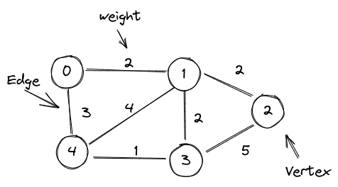

# How to Solve - Graphs

## What are Graphs?

A **Graph** is a non-linear data structure consisting of nodes and edges. We can refer to nodes as vertices and the edges as the relation between two nodes.

Look at the image below:



If we convert this Graph into code it should look like this:

```c++
int main()
{
  int graph[5][5] = {
    {0, 2, 0, 0, 3}, // 0
    {2, 0, 2, 2, 4}, // 1
    {0, 2, 0, 5, 0}, // 2
    {0, 2, 5, 0, 1}, // 3
    {3, 4, 0, 1, 0}  // 4
  };
}
```

Yeah, I know, you must be wondering what is that matrix. See the comments in the code, each row corresponds to a vertice.

Now look at vertice 0, it is connected to vertice 1 and vertice 4. If we look at the row we have the following:

```c++
 { V0, V1, V2, V3, V4 },
 { 0,  2,  0,  0,  3  }
```

Now you can see that each value of the row corresponds to the edge with each vertice. Vertice 0 is only connected with Vertice 1 and 4, the value that we use is the **weight of the edge**.

If you think that the vertices are Stores, and the edges are the distance between them, then you can look for the shortest way for reaching Vertice 2 starting from Vertice 0. The Answer is 4, using V0 -> V1 -> V2.

Obviously with this you can also get the longest route: V0 -> V4 -> V2 -> V3 -> V5

## How to Initialize a Graph

Yeah we defined how a graph should like into code, in the hardcoded way, but you must remember, you cannot create a dynamic matrix, so we need at first know our vertices.

The simplest thing to do is ask how many vertices we have.

```c++
  int n;

  scanf("%d", &n);
```

The next step is to create our graph:

```c++
#include <iostream>
#include <cstring>

using namespace std;

int main() {
  // How many vertices?
  int n = 5;

  int graph[n][n]; // A matrix 5x5
  char str[100];

  // For each row
  for (int i = 0; i < n; i++) {
    cout << " Enter edges for row " << i << endl;
    cin.getline(str, 100);
    // Ex: 1,0,0,1,0

    int j = 0;
    char *ptr; 
    ptr = strtok(str, " , ");

    // Add edge values to the graph
    while (ptr != NULL) {
      // Convert to integer.
      sscanf(ptr, "%d", &graph[i][j]);

      j++;
      ptr = strtok(NULL, " , ");
    }
  }

  // After this you have the graph definition
  // { 0, 1, 1, 0, 0 }
  // { 0, 1, 1, 0, 0 }
  // { 0, 1, 1, 0, 0 }
  // { 0, 1, 1, 0, 0 }
  // { 0, 1, 1, 0, 0 }
}
```

With all this now you have a graph representation. So you can start working on Dijkstra and Primm.

### Dijkstra

We will start defining **Greedy Algorithm** is a simple, intuitive algorithm that is used in optimization problems. The algorithm tries to find the overall optimal way to solve the problem.

https://www.geeksforgeeks.org/dijkstras-shortest-path-algorithm-greedy-algo-7/