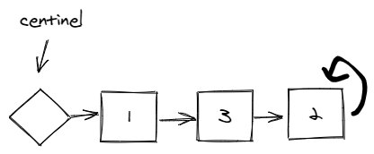
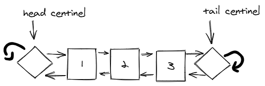
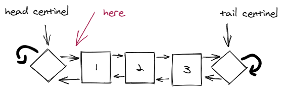
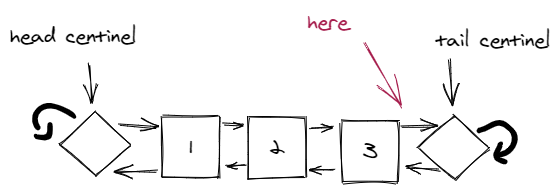
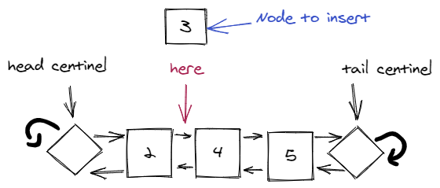

# How to Solve - Double Linked Lists

## Mission 8 - Create a  Double Linked List

For this Mission you will accomplish the following:

* Make a program that simulates a Double Linked List

The Program should consist of the following instructions:

1. Insert node (This can be done inserting on the head or in the tail)
2. Insert node in Ascending Order
3. Print the List
4. Clear the List

For this case you will be using the following structure as the data in the node:

```json
{// Point
  "value": 1.300,
}
```

### Exploration - Double Linked Lists

As you must remeber Simply Linked Lists are a structure that links one data node with another data node. So you have something like the following image:



With this kind of structure you should realize by now, that if you want to insert at the end of the list, you must iterate over all the elements to reach the last element. That solution can go fine with a low number of elements, but let's say that we have about 1 million elements, it can take many seconds just to reach the end.

Futhermore this can be solved using two centinels:



Using two centinels allow us to remove the iteration over all the elements. With this we can take the tail and insert a new element before the centinel. The same goes with the next element.

There is also another capability we achieve using double linked lists, using simply linked list we can know what element whas the following but not the previous. Using double linked list we know the next and the previous element.

The structure used for the Double linked is the following

```json
{
    ...// values of the structure
    "next": *,
    "previous": *,
}
```

### Objective 1.- Let's structure our new Stack

As always we will be using our dear node structure:

```json
{
    "value": 1
}
```

With that our code will look like this:

```c++
typedef struct Point {
    float value = 0;
} Point;

typedef struct Node {
    Point p;
    struct Node *next;
    struct Node *prev;
} Node;
```

First we will explain the first block, the first block refers to the element that we are storing in our list. Our element is a defined type, so this "point" can have other parameters, like an ID, or some Weight.

The following block refers to our double linked list structure. This structure will help us to create an adequate ordered list.

### Objective 2. Adding more nodes

We are working with unknown amount of memory we need to check if we can create an element before trying to insert into the double linked list.

```c++
// Function that creates a node
Node *CreateNode(Node elem);

int main()
{
  // Example how to initialize the head and tail
  Node *head; Node *tail;

  if ((head = CreateNode(*(head))) == NULL) {
    return 1;
  }

  if ((tail = CreateNode(*(head))) == NULL) {
    return 1;
  }

  head->prev = head;
  head->next = tail;
  tail->prev = head;
  tail->next = tail;
}

/**
 * The following function creates a node for the double linked list
 */
Node *CreateNode(Node elem)
{
  // Try to allocate some memory for the element
  Node *aux = NULL;
  if ((aux = new Node[1]) == NULL) {
    return NULL;
  }

  // Link the node with itself
  *(aux) = elem;
  aux->next = aux;
  aux->prev = aux;

  return aux;
}
```

### Objective 3. Inserting Points

On this case we need to insert a point element into our double linked list.

For doing this we need two kinds of insertion:

1. Insertion on the head. 
2. Insertion on the tail. 

```c++
bool insert(Node *head, Node *tail, Point elem, bool type);

int main()
{
  // ...

  // Example:
  Point p01;
  p01.value = 1.300;

  // Insert after the head
  if (insert(head, tail, p01, true)) {
    cout << "inserted on head" << endl;
  }

  // insert before the tail
  if (insert(head, tail, p01, false)) {
    cout << "inserted on tail" << endl;
  }
}

/**
 * Function to insert a Point in the head or tail
 */
bool insert(Node *head, Node *tail, Point elem, bool type)
{
  // Try to reserve memory for the node
  Node *newItem;
  if ((newItem = CreateNode(*(newItem))) == NULL) {
    return false;
  }

  // Insert the Point into the value
  newItem->p = elem;
  newItem->prev = newItem;
  newItem->next = newItem;

  // Insert after the head
  if (type) {
    newItem->next = head->next;
    newItem->prev = head;
  } 
  // Insert before the tail
  else {
    newItem->next = tail;
    newItem->prev = tail->prev;
  }

  // Link the previous and next element with the current element.
  newItem->prev->next = newItem;
  newItem->next->prev = newItem;

  return true;
}

```

As you can see it's pretty easy to understand what are we trying to achieve.

### Objective 4. I need some order...

In some cases we may need that our elements keep in order, but don't think that this program will always insert in order. As you must know using insert function we only insert on the head or tail. So even if we try to insert in order the elements will never be in the order.



```c++
bool insertedOrder(Node *head, Point elem);

int main()
{
  // ...

  // Example:
  Point p01, p02, p03, p04;
  p01.value = 4.000;
  p02.value = 2.000;
  p03.value = 1.000;
  p04.value = 6.000;

  insertedOrder(head, p01);
  insertedOrder(head, p02);
  insertedOrder(head, p03);
  insertedOrder(head, p04);
}

bool insertedOrder(Node *head, Point elem)
{
  // Try to allocate memory
  Node *newItem;
  if ((newItem = CreateNode(*(newItem))) == NULL) {
    return false;
  }

  // Insert point in node
  newItem->p = elem;
  newItem->prev = newItem;
  newItem->next = newItem;

  Node *it = head->next;

  // until reach of the tail centinel
  while (it->next != it && it->p.x < newItem->p.x) {
    it = it->next;
  }
  
  newItem->next = it;
  newItem->prev = it->prev;
  newItem->prev->next = newItem;
  newItem->next->prev = newItem;

  return true;
}
```

### Objective 5. What we did?

Maybe you are testing the examples to see if the program works, but you don't know if the program is working correctly. We need a way to tell if the elements are being inserted in the position where is supposed to be.

For that we need a Print function so we can have a better idea of what are we doing.

```c++
void Print(Node *head);

/**
 * Function that prints a list of elements
 */
void Print(Node *head)
{
  cout << "------------" << endl;
  Node *iterator = head->next;

  while (iterator->next != iterator->next->next) {
    cout << iterator->p.x << endl;
    iterator = iterator->next;
  }

  if (head != iterator) {
    cout << iterator->p.x <<endl;
  }
}
```

### Objective 6. Abort the mission

Yes as you have guessed we need a way to remove all the elements. And this task will be given to you.

1. For all the elements after the head until you reach the tail
    1. remove the element
2. head->next = tail;
3. tail->prev = head;

After this, you can complete the assignature, I wish you good luck!